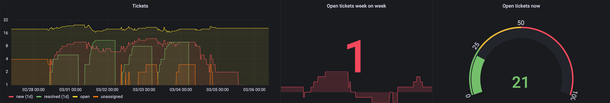
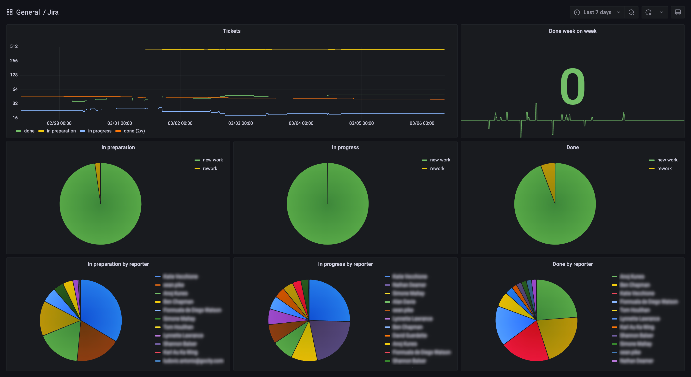
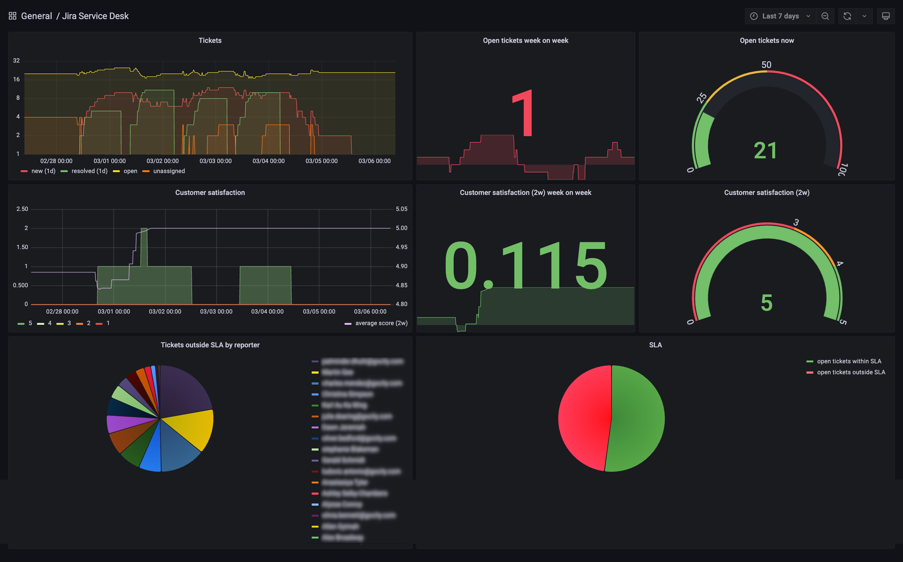
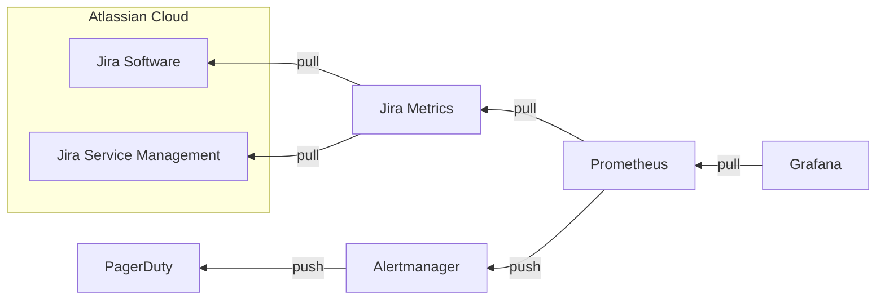

# Team dashboards for Jira



As developers we tend to spend a lot of time in Atlassian Jira. Many of us also spend more time than we should on team dashboards. If both of these descriptions fit you, chances are you have looked up Jira's built-in reports to see what is available out of the box. If your experience is anything like mine, you will have come away disappointed. Jira offers a limited range of inputs, and little room to customise how they are shown in these reports. You are likely to find a chart that features some of the data points that interest you, but probably not all.

This lack of inputs and presentation choices is one problem, but there is another. It seems to me that the intended users of these reports are managers, not developers. What makes me think so? Create a Jira report, and the default "statistic type" is the "Assignee". Who resolved the most issues? Never mind that some of the people appearing in that pie chart left the company long ago. Open Jira Service Management, and you will similarly find that reports foreground the top performers; who garnered the highest customer satisfaction scores; and also who holds most overdue tickets. Managers may find this useful. Developers certainly don't. They sense that excessive emphasis on individual contribution works against the team.

If you would like to create your own Jira team dashboards in Grafana, focusing on insights that teams actually care about – the relative amount of toil versus innovative work being done, for example – read on.

## The proposal
The suggested approach is simple: teams define the data points they want from Jira. The Jira Metrics service queries Jira and makes the results available to Prometheus. The teams then build Grafana dashboards based on the time-series data stored in Prometheus. The configuration is submitted in git, and ideally the dashboards, also, are deployed as code.

Jira Metrics deals with three use cases:

* developers can submit custom Jira Query Language (JQL) queries (e.g. show all issues belonging to a particular epic that are in progress) and register Prometheus counters, gauges or histograms
* they can also specify the name (technically, the short "key") of their Jira board to retrieve a standard set of metrics (e.g. a breakdown of in-progress tickets by submitter)
* for Jira Service Management queues, they can add one or more queues and Jira Metrics will gather SLA data, customer satisfaction scores, and so on

The configuration is submitted as YAML and validated when the service spins up, so malformed or invalid input will not take down a working Jira Metrics instance.

## Custom queries
This is how developers might express custom JQL queries in code:

```yaml
server: acme.atlassian.net
interval_seconds: 300
metrics:
  - query: 'project = "ACME" AND "Epic Link" IN ("Tech Debt","Incident","Defects","Business as Usual") AND resolved > -2w'
    metric_name: acme_completed_rework_issues
    metric_type: gauge
    metric_help: 'ACME completed rework'
```

Note that the `query` property takes JQL strings familiar from the Advanced Issue Search screen. The value prepared for consumption by Prometheus is the total number of issues matching this query. Jira Metrics will prepend `jira_metrics` to the metric name. The usual naming conventions apply. Here it is worth stating that we are counting issues, not adding the story point estimates for all matches.

Unlike Prometheus staples such as 4xx or 5xx response counts, these metrics are slow-moving targets, so retrieving data every five minutes is if anything more than is needed.

If gathering the data you are after in this way feels like too much work – especially considering you still need to build a dashboard for your custom metrics – consider submitting your board to Jira Metrics instead.

## Jira boards



The template for boards focuses on three areas: firstly, it gathers metrics on stories in preparation, in progress and recently completed; secondly, it distinguishes between work and rework (whether we conceive of the latter as "business as usual", "incident response"  or "reactive"). Finally, it breaks down tickets by reporter.

The properties your team would fill in are these:

```yaml
boards:
  - name: ACME
    in_progress_labels: '"in progress","pending close"'
    in_preparation_labels: '"backlog","selected for development"'
    business_as_usual_epics: '"business as usual","tech debt"'
    iteration_length_weeks: 2
```

There are nearly as many labelling conventions as there are teams using Jira boards, so it seemed safest to let the user specify which labels represent which stage of your workflow. Some teams are three-swimlane purists. Others start with five columns and debate the benefit of adding a sixth. These dashboards should provide value to both groups.

## Jira Service Management queues



Queues are if anything better suited to templated dashboards than Kanban boards. Tickets are or are not in breach of their service level agreement; Jira Service Management gathers customer satisfaction feedback automatically; the number of open or unassigned tickets is often a meaningful data point.

As a result, the configuration teams need to supply is minimal:

```yaml
queues:
  - name: ACMESD
    time_zone: UTC
```

As before, the focus is on who submitted a ticket, not on the individual processing it. It is useful for the team to know whose submissions are most likely to be overdue. This could signal, for example, that one reporter pushes very firmly for timely completion, possibly edging out equally important issues by less vocal reporters. We are building a team dashboard, and its role is to help the team serve its customers better.

How does the timezone help? It allows Jira Metrics to mark issues coming in at night or over the weekend as out-of-hours. For our service desk that means we can send out-of-hours issues from Prometheus (via Alertmanager) to PagerDuty. Another built-in metric flags P1 incidents reported to the service desk. Alertmanager sends them straight to the platform team's first responder.

We decide how to respond to the metrics Prometheus obtains from Jira Metrics. We can build an alerting chain, but we can also divert the alert to a Stat panel in Grafana or ignore it altogether.



## The dashboards
One advantage of using templated dashboards is that they lend themselves to parameterisation. If you have five engineering teams and two service desk teams, you only need to install two Grafana dashboards and add the seven project names to them.

As with most dashboards, it usually helps to share them as widely as is responsible within your organisation. If you work remotely, place them behind your corporate identity provider (be that Google, Microsoft or any other). If you find yourself in an office equipped with wall-mounted screens, place the dashboards on rotation there.

If a colleague from Finance asks you about the difference between work and rework, you may find yourself drawn into a conversation about operational expenditure, capital expenditure, EBITDA and the cloud. You may even find that Finance use Jira, too. If so, you have every reason to add a sixth name to your templated Jira team dashboard.

## Source
If you'd like to create Jira team dashboards, you are welcome to clone [gocityengineering/jira-metrics](https://github.com/gocityengineering/jira-metrics). You can use any Kubernetes cluster (`minikube` will do) to deploy the application. Configure Prometheus to scrape the application and use the two JSON templates in the folder [dashboards](https://github.com/gocityengineering/jira-metrics/tree/main/dashboards) to set up your dashboards in Grafana.
